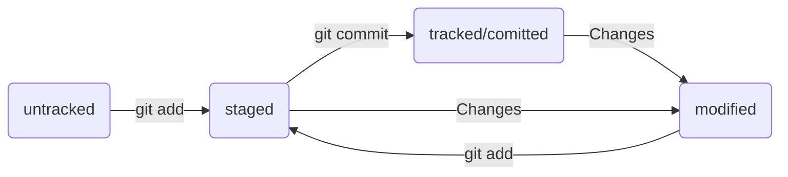

  
# О проекте "Справочник по Git"
  *Данный проект основан на обучении основам Git.*
  *Здесь будет представлен проект-помощник по Git*
  ## Список команд и понятий

  ### Навигация
  * pwd (от англ. print working directory, «показать рабочую папку») — покажи, в какой я папке;
  * ls (от англ. list directory contents, «отобразить содержимое директории») — покажи файлы и папки в текущей папке;
  * ls -a — покажи также скрытые файлы и папки, названия которых начинаются с символа .;
  * cd first-project (от англ. change directory, «сменить директорию») — перейди в папку first-project;
  * cd first-project/html — перейди в папку html, которая находится в папке first-project;
  * cd .. — перейди на уровень выше, в родительскую папку;
  * cd ~ — перейди в домашнюю директорию (/Users/Username);
  * cd / — перейди в корневую директорию.

  ### Работа с файлами и папками

1.Создание

* touch index.html (англ. touch, «коснуться») — создай файл index.html в текущей папке;
* touch index.html style.css script.js — если нужно создать сразу несколько файлов, можно напечатать их имена в одну строку через пробел;
* mkdir second-project (от англ. make directory, «создать директорию») — создай папку с именем second-project в текущей папке.

2.Копирование и перемещение

  * cp file.txt ~/my-dir (от англ. copy, «копировать») — скопируй файл в другое место;
  * mv file.txt ~/my-dir (от англ. move, «переместить») — перемести файл или папку в другое место.

3.Чтение

  * cat file.txt (от англ. concatenate and print, «объединить и распечатать») — распечатай содержимое текстового файла file.txt.

4.Удаление

* rm about.html (от англ. remove, «удалить») — удали файл about.html;
* rmdir images (от англ. remove directory, «удалить директорию») — удали папку images;
* rm -r second-project (от англ. remove, «удалить» + recursive, «рекурсивный») — удали папку second-project и всё, что она содержит.


  ## Инструкция по инициализации проекта

* Чтобы Git начал отслеживать изменения в проекте, папку с файлами этого проекта нужно сделать Git-репозиторием (от англ. repository — «хранилище»).  Для этого следует переместиться в неё и ввести команду **git init** (от англ. initialize — «инициализировать»).

Например, создайте папку first-project и сделайте её Git-репозиторием: перейдите в неё с помощью команды cd и выполните git init.

* Если вы случайно сделали Git-репозиторием не ту папку, её можно «разгитить». Для этого нужно удалить скрытую подпапку .git.

```BASH
$ cd <папка с репозиторием> # перешли в папку

$ rm -rf .git # удалили подпапку .git
```

ключ -r (от англ. recursive — «рекурсивно») позволяет удалять папки вместе с их содержимым;
ключ -f (от англ. force — «заставить») избавит вас от вопросов вроде «Вы точно хотите удалить этот файл? А этот? И этот тоже?».

* Будьте осторожны: в подпапке .git хранится история изменений. Если удалить .git, то вся история проекта будет стёрта без возможности восстановления — останется только последняя версия файлов.

* После инициализации репозитория first-project запустите команду **git status** (от англ. status — «статус», «состояние») — она показывает текущее состояние репозитория.

  ## Добавляем файлы в репозиторий
* Команда **git add** позволяет подготовить файл к сохранению.
* Команда **git add --all** подготовит к сохранению сразу все файлы.
* С помощью **git add .** можно добавить в репозиторий текущую папку со всеми файлами.
* Коммит можно сделать с помощью команды **git commit**
Ключ -m позволяет присвоить коммиту сообщение. Помните, что такие сообщения должны быть информативными: чётко описывать изменения.
* Просмотреть историю коммитов — **git log**

  ## Связываем удаленный и локальный репозиторий

1.Создаем удаленный репозиторий на GitHub

2.Привязываем удалённый репозиторий к локальному: **git remote add**

Перейдите на страницу удалённого репозитория, выберите тип SSH и скопируйте URL. 
Откройте консоль, перейдите в каталог локального репозитория и введите команду git remote add (от англ. remote — «удалённый» и add — «добавить»).

```BASH
$ cd ~/dev/first-project
$ git remote add origin git@github.com:%ИМЯ_АККАУНТА%/first-project.git 
```

*origin* (англ. «источник») — стандартный псевдоним, с помощью которого можно обращаться к главному удалённому репозиторию (обычно такой репозиторий один). Это значительно упрощает работу.

3.Убедимся, что репозитории связаны: **git remote -v**

```BASH
$ git remote -v
origin    git@github.com:%ИМЯ_АККАУНТА%/%ИМЯ-ПРОЕКТА%.git (fetch)
origin    git@github.com:%ИМЯ_АККАУНТА%/%ИМЯ-ПРОЕКТА%.git (push)
```
 В выводе вы должны увидеть две строчки, аналогичные тем, что показаны выше.
Флаг -v — короткая форма флага --verbose (англ. «подробный»). Он позволяет показать больше информации в выводе. 

  ## Синхронизируем ветки

Вы уже прошли весь «цикл коммита»: подготовили файлы с помощью git add, закоммитили их с комментарием командой git commit -m. Осталось загрузить содержимое локального репозитория на GitHub. За это отвечает команда **git push** (от англ. push — «толкать»).

В первый раз эту команду нужно вызвать с флагом -u и параметрами origin (имя удалённого репозитория) и main или master (название текущей ветки). 
Флаг -u свяжет локальную ветку с одноимённой удалённой. 
Как вы связывали локальный и удалённый репозитории в предыдущем уроке, так же и здесь нужно дополнительно связать ветки.
 
```BASH
$ git push -u origin main # Если команда приведёт к ошибке, попробуйте 
                          # заменить main на master.
```

При взаимодействии с удалёнными репозиториями Git выводит в консоль отладочную информацию: количество объектов (файлов), которые отправляются на сервер, информацию о прогрессе сжатия и записи и так далее.
Зайдите в репозиторий first-project на GitHub. Вы увидите, что в репозитории появились файлы с изменениями.

В дальнейшем при работе с удалённым репозиторием флаг -u можно опустить и писать просто git push.
Интерфейс GitHub позволяет удобно просмотреть все коммиты в репозитории, а также изменения в этих коммитах.


  ## Хеш — идентификатор коммита
Git преобразует информацию о коммитах с помощью алгоритма SHA-1 и для каждого из них рассчитывает уникальный идентификатор — **хеш**.
Хеш — основной идентификатор коммита и позволяет узнать его автора, дату и содержимое закоммиченных файлов.

Git хранит таблицу соответствий <u>хеш → информация о коммите</u>. Если вы знаете хеш, вы можете узнать всё остальное: автора и дату коммита и содержимое закоммиченных файлов. 
Можно сказать, что *хеш — основной идентификатор коммита*.

При работе с Git хеши будут встречаться вам регулярно. Их можно будет *передавать в качестве параметра* разным Git-командам, чтобы указать, с каким коммитом нужно произвести то или иное действие.
Все хеши и таблицу хеш → информация о коммите Git сохраняет в служебные файлы. Они находятся в скрытой папке **.git** в репозитории проекта.

  ## Исследуем лог

В этом уроке рассмотрим подробнее, из каких элементов состоит описание коммита, а также как вывести сокращённый лог (от англ. log — «журнал [записей]»). Сокращённый лог полезен, если нужно быстро найти нужный коммит среди сотни других.

1.Элементы описания коммита
После вызова **git log** появляется список коммитов.

Разберём элементы, из которых состоит описание:

* строка из цифр и латинских букв после слова commit — это хеш коммита;
* Author — имя автора и его электронная почта;
* Date — дата и время создания коммита;
* в конце находится сообщение коммита.

2.Получить сокращённый лог

Получить сокращённый лог можно с помощью команды **git log** с флагом **--oneline** (англ. «одной строкой»). 
В терминале появятся только первые несколько символов хеша каждого коммита и их комментарии.

Сокращённый лог полезен, если в репозитории уже много коммитов — например, сотни или тысячи. В этом случае можно быстро найти нужный по описанию.
Сокращённый хеш (то есть первые несколько символов полного) можно использовать точно так же, как и полный. 
Для этого команда **git log --oneline** автоматически подбирает такую длину сокращённых хешей, чтобы они были уникальными в пределах репозитория и Git всегда мог понять, о каком коммите идёт речь.

   ## Файл HEAD

При вызове команды **git log** вы также могли заметить надпись (HEAD -> master) после хеша одного из коммитов. 
В этом разделе расскажем, что она означает.

Файл HEAD (англ. «голова», «головной») — один из служебных файлов папки .git. Он указывает на коммит, который сделан последним (то есть на самый новый).

В этом можно убедиться с помощью терминала. Перейдите в папку .git командой cd. Посмотрите содержимое файла HEAD командой cat.
Внутри HEAD — ссылка на служебный файл: refs/heads/master (или refs/heads/main в зависимости от названия ветки). Если заглянуть в этот файл, можно увидеть хеш последнего коммита.

Когда вы делаете коммит, Git обновляет refs/heads/master — записывает в него хеш последнего коммита. Получается, что HEAD тоже обновляется, так как ссылается на refs/heads/master.

При работе с Git указатель HEAD используется довольно часто. Мы уже упоминали, что многие команды Git принимают в качестве параметра хеш коммита. Если нужно передать последний коммит, то вместо его хеша можно просто написать слово HEAD — Git поймёт, что вы имели в виду последний коммит.

  ## Статусы файлов в Git

Одна из ключевых задач Git — отслеживать изменения файлов в репозитории. Для этого каждый файл помечается каким-либо статусом. 

Рассмотрим основные.

* **untracked** (англ. «неотслеживаемый»)

Мы говорили, что новые файлы в Git-репозитории помечаются как untracked, то есть неотслеживаемые. Git «видит», что такой файл существует, но не следит за изменениями в нём. У untracked-файла нет предыдущих версий, зафиксированных в коммитах или через команду git add.

* **staged** (англ. «подготовленный»)
  После выполнения команды git add файл попадает в staging area (от англ. stage — «сцена», «этап [процесса]» и area — «область»), то есть в список файлов, которые войдут в коммит. В этот момент файл находится в состоянии staged.

  В одном из предыдущих уроков мы сравнили коммит с фотографией. Можно развить эту аналогию и сказать, что команда git add добавляет персонажей (текущее содержимое файла или нескольких файлов) на сцену (англ. stage) для общей фотографии, а git commit делает снимок всей сцены целиком. 

> Staging area также называют index (англ. «каталог») или cache (англ. «кеш»), а состояние файла staged иногда называют indexed или cached.
Все три варианта могут встречаться в документации и в качестве флагов команд Git. 

* **tracked** (англ. «отслеживаемый»)

Состояние tracked — это противоположность untracked. Оно довольно широкое по смыслу: в него попадают файлы, которые уже были зафиксированы с помощью git commit, а также файлы, которые были добавлены в staging area командой git add. То есть все файлы, в которых Git так или иначе отслеживает изменения.

* **modified** (англ. «изменённый»)

Состояние modified означает, что Git сравнил содержимое файла с последней сохранённой версией и нашёл отличия. Например, файл был закоммичен и после этого изменён.

>  Для файлов в состояниях staged и modified обычно не указывают, что они также tracked, потому что это состояние подразумевается.

#### Про staged и modified
Команда git add добавляет в staging area только текущее содержимое файла. 
Если вы, например, сделаете git add file.txt, а затем измените file.txt, то новое содержимое файла не будет находиться в staging.
Git сообщит об этом с помощью статуса modified: файл изменён относительно той версии, которая уже в staging. 
Чтобы добавить в staging последнюю версию, нужно выполнить git add file.txt ещё раз.

  ## Типичный жизненный цикл файлов в Git

Может показаться, что файлы в репозитории попадают в разные состояния хаотично. На практике это не так, и у большинства файлов вполне предсказуемый путь.




1.Файл только что создали. Git ещё не отслеживает содержимое этого файла. Состояние: untracked.

2.Файл добавили в staging area с помощью git add. Состояние: staged (+ tracked).

* Возможно, изменили файл ещё раз. Состояния: staged, modified (+ tracked).
Обратите внимание: staged и modified у одного файла, но у разных его версий.

* Ещё раз выполнили git add. Состояние: staged (+ tracked).

3.Сделали коммит с помощью git commit. Состояние: tracked.
4.Изменили файл. Состояние: modified (+ tracked).
5.Снова добавили в staging area с помощью git add. Состояния: staged (+ tracked).
6.Сделали коммит. Состояния: tracked.
7.Повторили пункты 4 − 7 много-много раз.

Выглядит довольно запутанно! Но на практике разобраться с этим будет проще, чем кажется. 

Таким образом, большинство файлов в проектах «шагает» по следующему циклу: «изменён» → «добавлен в список на коммит» → «закоммичен» → «изменён» → и так далее.

  ## Какие состояния показывает git status

Большинство файлов в типичном проекте будут находиться в состоянии **tracked** (то есть закоммичены и не изменены после коммита). 
Вы не увидите это состояние в выводе команды git status — иначе она бы каждый раз выводила список вообще всех файлов проекта.

В итоге git status показывает только следующие состояния файлов:

* **staged** (Changes to be committed в выводе git status);
* **modified** (Changes not staged for commit);
* **untracked** (Untracked files).

  ## Оформление сообщений к коммитам

То, как написаны сообщения коммитов, тоже может подчиняться определённым правилам. Иногда эти правила продиктованы культурой команды, а иногда техническими ограничениями.
Например, в выводе команды git log --oneline умещается максимум 72 первых символа сообщения, поэтому многие правила включают пункт: «Сообщение не должно быть длиннее 72 символов».
В этом уроке рассмотрим несколько популярных подходов к оформлению сообщений коммитов. Но сначала разберём, почему такие сообщения важны и зачем соблюдать правила их оформления.

  #### Зачем вообще писать сообщения
У каждого коммита в Git есть сообщение — то, что передаётся после параметра -m. Например: git commit -m "Добавить урок про оформление сообщений коммитов".

Сообщения коммитов можно сравнить с надписями на коробках в кладовке. Если надписей нет, то нужную коробку будет сложно найти: придётся заглянуть в каждую, чтобы понять, что там. А если надписи есть, то нужная найдётся сразу.
Как и надпись на коробке, сообщение коммита должно помочь определить, что внутри. Например, надпись на коробке «всякое разное» не очень полезная. Сообщение коммита «небольшие исправления» тоже: непонятно, что было исправлено в таком коммите и зачем.

<u>Общие рекомендации по составлению сообщений:</u>

* сообщение должно быть относительно коротким, чтобы его было легко прочитать;
* информативным.

  #### Стили оформления

Все люди разные и у всех есть предпочтения — в том числе, как формулировать сообщения коммитов. 
Кто-то использует инфинитивы: Исправить сообщение об ошибке E123, кто-то — глаголы в прошедшем времени: Исправил…, кто-то — существительные: Исправление….

Без единообразия коммитов нет и эффективной работы в Git. Это может показаться мелочью, но когда коммиты с сообщениями в разных стилях идут друг за другом, их может быть сложно читать.
Чтобы упростить работу, команды или даже целые компании часто договариваются об определённом стиле (то есть о правилах) оформления сообщений коммитов.

Есть много подходов к оформлению сообщений коммитов, но мы расскажем о нескольких популярных. Их используют как отдельные команды, так и целые проекты.

**1. Корпоративный**
Во многих компаниях применяется Jira — система для организации проектов и задач. У каждой задачи в Jira есть идентификатор из нескольких заглавных латинских букв и номера.
> Например, LGS-239 значит, что это 239-я задача в проекте LGS (сокращение от англ. logistics — «логистика»).

В корпоративном стиле в начале сообщения обычно указывают Jira-ID, а после — текст сообщения: 

```BASH
$ git commit -m "LGS-239: Дополнить список пасхалок новыми числами"
```
 
Какие-то команды могут договариваться, с какой части речи начинать сообщение и какой длины оно должно быть, какие-то — нет. 
Но требование о наличии Jira-ID обычно строгое: оно позволяет автоматически связывать коммиты с задачами и проектами.

**2. Conventional Commits**

Стандарт Conventional Commits (англ. «соглашение о коммитах») отличается качественной документацией и подробной проработкой. 
Он подходит для репозиториев с исходным кодом программ. 
Использовать его для других типов проектов (например, для перевода книги) было бы неудобно.

Conventional Commits предлагает такой формат коммита: <type>: <сообщение>. Первая часть type — это тип изменений. Таких типов достаточно много. 

>Вот два примера:
feat (сокращение от англ. feature) — для новой функциональности;
fix (от англ. «исправить», «устранить») — для исправленных ошибок.

Более подробный список можно увидеть на сайте с описанием этого стиля.
Например, сообщение может быть таким:

```BASH
git commit -m "feat: добавить подсчёт суммы заказов за неделю" 
```

**3. GitHub-стиль**

GitHub можно использовать не только для хранения файлов проекта, но и для ведения списка задач (англ. issue) этого проекта. 
Если коммит «закрывает» или «решает» какую-то задачу, то в его сообщении удобно указывать ссылку на неё. Для этого в любом месте сообщения нужно указать #<номер задачи>. 

Например, вот так:

```BASH
$ git commit -m "Исправить #334, добавить график температуры" 
```

В таком случае GitHub свяжет коммит и задачу.

## Добавление изменений в последний коммит

git commit --amend --no-edit (от англ. amend, «исправить») — добавь изменения к последнему коммиту и оставь сообщение прежним;

git commit --amend -m "Новое сообщение" — измени сообщение к последнему коммиту на Новое сообщение.

💡 Выйти из редактора Vim: нажать Esc, ввести :qa!, нажать Enter.
